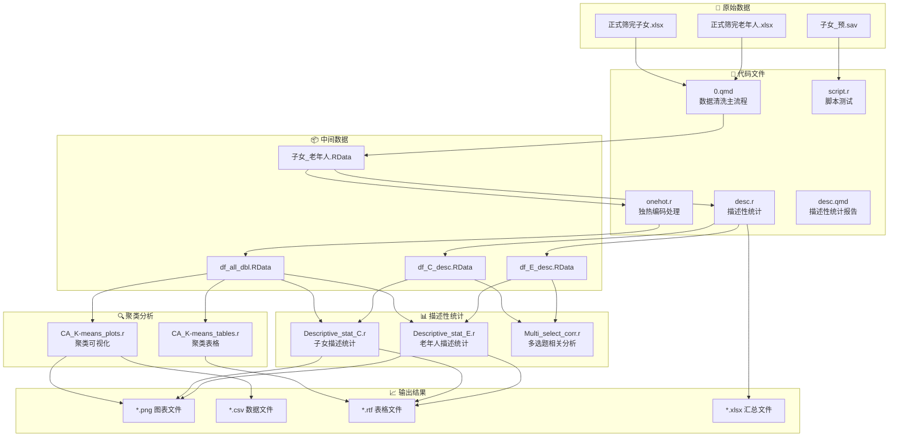

# R数据分析项目 - 数据流向分析报告

## 一、项目概览

本项目是关于"智护银龄，情暖夕阳"——基于厦门老年群体的智能养老设备需求图谱与使用意愿实证研究的数据分析流程。

### 文件结构
- **代码文件**: 9个 (.r 和 .qmd)
- **数据文件**: 存放在 `data/` 目录
- **输出文件**: 存放在 `output/` 目录
- **函数文件**: 存放在 `func/` 目录

---

## 二、数据流向图



---

## 三、各文件输入输出详细分析

### 1. 数据清洗与准备阶段

| 文件名 | 类型 | 输入文件 | 输出文件 | 依赖 |
|--------|------|----------|----------|------|
| **0.qmd** | 主流程 | `正式筛完子女.xlsx`, `正式筛完老年人.xlsx` | `子女_老年人.RData`, `子女.xlsx/sav/csv`, `老年人.xlsx/sav/csv` | `func/write_xlsx_with_auto_width.r` |
| **onehot.r** | 数据处理 | `老年人.xlsx`, `子女.xlsx` | `df_all_dbl.RData` | 无 |
| **script.r** | 脚本测试 | `子女_预.sav` | 无 | `func/spss_empty2na.r` |

### 2. 聚类分析阶段

| 文件名 | 类型 | 输入文件 | 输出文件 | 依赖 |
|--------|------|----------|----------|------|
| **CA_K-means_plots.r** | 聚类可视化 | `df_all_dbl.RData` | `01-06_*.png`, `子女/老年人_K-means聚类标签.csv` | `func/write_xlsx_with_auto_width.r` |
| **CA_K-means_tables.r** | 聚类表格 | `df_all_dbl.RData` (内存变量) | `子女/老年人体聚类特征剖面.rtf` | 无 |

### 3. 描述性统计阶段

| 文件名 | 类型 | 输入文件 | 输出文件 | 依赖 |
|--------|------|----------|----------|------|
| **desc.r** | 描述统计 | `子女_老年人.RData` | `df_C_desc.RData`, `df_E_desc.RData`, `子女_老年人_统计汇总.xlsx` | `func/write_xlsx_with_auto_width.r` |
| **Descriptive_stat_C.r** | 子女统计 | `df_all_dbl.RData`, `df_C_desc.RData` | `C_01-03_*.png`, `子女_分类/数值变量统计.rtf` | `func/write_xlsx_with_auto_width.r` |
| **Descriptive_stat_E.r** | 老年人统计 | `df_all_dbl.RData`, `df_E_desc.RData` | `E_01-03_*.png`, `老年人_分类/数值变量统计.rtf` | `func/write_xlsx_with_auto_width.r` |
| **Multi_select_corr.r** | 相关分析 | `df_C_desc.RData`, `df_E_desc.RData` | 无(仅显示图表) | 无 |
| **desc.qmd** | 统计报告 | `子女_老年人.RData` | HTML报告 | 无 |

### 4. 函数文件

| 文件名 | 功能 | 被调用文件 |
|--------|------|------------|
| **spss_empty2na.r** | SPSS空值转NA | `script.r` |
| **write_xlsx_with_auto_width.r** | 自动调整列宽写入Excel | `0.qmd`, `desc.r`, `Descriptive_stat_C.r`, `Descriptive_stat_E.r`, `CA_K-means_plots.r` |
| **fixed_scale.r** | 数据标准化 | 未被调用 |

---

## 四、数据流向详细图

```
┌─────────────────────────────────────────────────────────────────────────────┐
│                              数据流向详细图                                   │
└─────────────────────────────────────────────────────────────────────────────┘

【第一层：原始数据】
    │
    ├── 正式筛完子女.xlsx ───────────────────┐
    │                                         │
    ├── 正式筛完老年人.xlsx ──────────────────┤
    │                                         ▼
    │                              ┌─────────────────┐
    │                              │    0.qmd        │
    │                              │  (数据清洗)      │
    │                              └────────┬────────┘
    │                                       │
    │                    ┌──────────────────┼──────────────────┐
    │                    ▼                  ▼                  ▼
    │            子女.xlsx/csv/sav   老年人.xlsx/csv/sav   子女_老年人.RData
    │                    │                  │                  │
    │                    └──────────────────┼──────────────────┘
    │                                       ▼
    │                              ┌─────────────────┐
    │                              │   onehot.r      │
    │                              │  (独热编码)      │
    │                              └────────┬────────┘
    │                                       ▼
    │                              ┌─────────────────┐
    │                              │  df_all_dbl.RData│
    │                              └────────┬────────┘
    │                                       │
    │         ┌─────────────────────────────┼─────────────────────────────┐
    │         │                             │                             │
    │         ▼                             ▼                             ▼
    │  ┌─────────────┐            ┌─────────────────┐            ┌─────────────────┐
    │  │CA_K-means_  │            │Descriptive_stat_│            │Descriptive_stat_│
    │  │  plots.r    │            │     C.r         │            │     E.r         │
    │  └──────┬──────┘            └────────┬────────┘            └────────┬────────┘
    │         │                            │                             │
    │    ┌────┴────┐                       │                             │
    │    ▼         ▼                        ▼                             ▼
    │  *.png    *.csv              ┌─────────────────┐            ┌─────────────────┐
    │                              │  df_C_desc.RData │            │  df_E_desc.RData │
    │                              └────────┬────────┘            └────────┬────────┘
    │                                       │                             │
    │                                       ▼                             ▼
    │                              ┌─────────────────┐            ┌─────────────────┐
    │                              │Multi_select_    │            │      ...        │
    │                              │   corr.r        │            │                 │
    │                              └─────────────────┘            └─────────────────┘
    │
    └── 子女_预.sav ─────────────────────────► script.r (测试脚本)


【第二层：中间数据依赖关系】

    df_all_dbl.RData
        ├── df_C_all_dbl (子女独热编码数据)
        └── df_E_all_dbl (老年人独热编码数据)

    df_C_desc.RData
        └── df_C_desc (子女描述统计专用数据)

    df_E_desc.RData
        └── df_E_desc (老年人描述统计专用数据)

    子女_老年人.RData
        ├── df_C (子女清洗后数据)
        └── df_E (老年人清洗后数据)
```

---

## 五、潜在问题分析

### ⚠️ 问题1：同名输出文件覆盖风险

| 问题描述 | 风险等级 | 详情 |
|----------|----------|------|
| **CA_K-means_plots.r** 和 **CA_K-means_tables.r** 都使用 `df_C_cluster_tag` 和 `df_E_cluster_tag` | 🔴 高 | 两个文件都生成聚类标签，如果分别运行可能导致结果不一致 |

**建议**: 确保两个文件使用相同的随机种子(set.seed)和聚类参数。

---

### ⚠️ 问题2：孤儿文件（输出未被读取）

| 文件 | 输出 | 状态 |
|------|------|------|
| **script.r** | 无输出，仅测试 | ✅ 正常 |
| **Multi_select_corr.r** | 仅显示图表，未保存 | 🟡 建议添加保存语句 |
| **desc.qmd** | HTML报告 | ✅ 正常 |

**建议**: `Multi_select_corr.r` 应该添加 `ggsave()` 保存相关分析图表。

---

### ⚠️ 问题3：依赖内存变量而无显式加载

| 文件 | 依赖的内存变量 | 问题 |
|------|----------------|------|
| **CA_K-means_tables.r** | `df_C_all_dbl`, `df_E_all_dbl`, `df_C_cluster_tag`, `df_E_cluster_tag` | ⚠️ 依赖 `CA_K-means_plots.r` 运行后的内存变量 |
| **Descriptive_stat_C.r** | `df_C_all_dbl`, `df_C_desc` | ⚠️ 需要前置文件运行 |
| **Descriptive_stat_E.r** | `df_E_all_dbl`, `df_E_desc` | ⚠️ 需要前置文件运行 |
| **Multi_select_corr.r** | `df_C_desc`, `df_E_desc` | ⚠️ 需要前置文件运行 |

**风险**: 如果单独运行这些文件，会因为变量不存在而报错。

---

### ⚠️ 问题4：未使用的函数

| 函数文件 | 状态 | 建议 |
|----------|------|------|
| **fixed_scale.r** | 未被任何文件调用 | 可以删除或在未来分析中使用 |

---

## 六、推荐执行顺序

### 完整执行流程

```
┌────────────────────────────────────────────────────────────────┐
│                    推荐执行顺序                                 │
├────────────────────────────────────────────────────────────────┤
│                                                                │
│  第1步: 0.qmd                                                  │
│  ├── 输入: 正式筛完子女.xlsx, 正式筛完老年人.xlsx              │
│  └── 输出: 子女_老年人.RData, 子女.xlsx/sav/csv, 老年人.xlsx   │
│                                                                │
│  第2步: onehot.r                                               │
│  ├── 输入: 子女.xlsx, 老年人.xlsx                              │
│  └── 输出: df_all_dbl.RData                                    │
│                                                                │
│  第3步: desc.r                                                 │
│  ├── 输入: 子女_老年人.RData                                   │
│  └── 输出: df_C_desc.RData, df_E_desc.RData, 统计汇总.xlsx     │
│                                                                │
│  第4步: CA_K-means_plots.r  (必须先运行)                       │
│  ├── 输入: df_all_dbl.RData                                    │
│  └── 输出: 聚类图表, 聚类标签.csv, 内存变量                    │
│                                                                │
│  第5步: CA_K-means_tables.r  (依赖第4步)                       │
│  ├── 输入: df_all_dbl.RData + 内存变量                         │
│  └── 输出: 聚类特征剖面.rtf                                    │
│                                                                │
│  第6步: Descriptive_stat_C.r                                   │
│  ├── 输入: df_all_dbl.RData, df_C_desc.RData                   │
│  └── 输出: C_*.png, 子女_*.rtf                                 │
│                                                                │
│  第7步: Descriptive_stat_E.r                                   │
│  ├── 输入: df_all_dbl.RData, df_E_desc.RData                   │
│  └── 输出: E_*.png, 老年人_*.rtf                               │
│                                                                │
│  第8步: Multi_select_corr.r                                    │
│  ├── 输入: df_C_desc.RData, df_E_desc.RData                    │
│  └── 输出: 相关分析图表 (建议添加保存)                         │
│                                                                │
│  第9步: desc.qmd                                               │
│  ├── 输入: 子女_老年人.RData                                   │
│  └── 输出: HTML报告                                            │
│                                                                │
│  可选: script.r (测试脚本)                                     │
│  ├── 输入: 子女_预.sav                                         │
│  └── 输出: 无                                                  │
│                                                                │
└────────────────────────────────────────────────────────────────┘
```

### 简化执行顺序（命令行）

```r
# 在R中按顺序运行：
source("code/0.qmd")                    # 或手动运行
source("code/onehot.r")
source("code/desc.r")
source("code/CA_K-means_plots.r")       # 必须先运行，生成内存变量
source("code/CA_K-means_tables.r")      # 依赖上一文件
source("code/Descriptive_stat_C.r")
source("code/Descriptive_stat_E.r")
source("code/Multi_select_corr.r")
# desc.qmd 需要手动在RStudio中运行
```

---

## 七、文件依赖关系图

```
                    ┌─────────────────────────────────────────┐
                    │           文件依赖关系图                 │
                    └─────────────────────────────────────────┘

    ┌──────────────┐
    │  0.qmd       │
    │ (数据清洗)    │
    └──────┬───────┘
           │
           ▼
    ┌──────────────┐
    │ onehot.r     │
    │ (独热编码)    │
    └──────┬───────┘
           │
           ▼
    ┌─────────────────────────────────────────────────────────────┐
    │                      df_all_dbl.RData                       │
    └──────────────┬──────────────────────────────┬───────────────┘
                   │                              │
                   ▼                              ▼
          ┌──────────────┐              ┌──────────────┐
          │CA_K-means_   │              │ desc.r       │
          │  plots.r     │              │ (描述统计)    │
          └──────┬───────┘              └──────┬───────┘
                 │                             │
                 ▼                             ▼
          ┌──────────────┐              ┌──────────────┐
          │CA_K-means_   │              │ df_C_desc    │
          │ tables.r     │              │ df_E_desc    │
          │ (依赖plots)   │              └──────┬───────┘
          └──────────────┘                     │
                                               ▼
                                      ┌──────────────┐
                                      │Descriptive_  │
                                      │ stat_C.r     │
                                      │Descriptive_  │
                                      │ stat_E.r     │
                                      └──────┬───────┘
                                             │
                                             ▼
                                      ┌──────────────┐
                                      │Multi_select_ │
                                      │ corr.r       │
                                      └──────────────┘


    图例:
    ──────► 数据流向/依赖关系
    ┌───┐  代码文件
    └───┘  数据文件
```

---

## 八、优化建议

### 1. 解决内存变量依赖问题

**CA_K-means_tables.r** 应该添加显式数据加载：

```r
# 在文件开头添加
load("data/df_all_dbl.RData")

# 聚类标签应该从csv读取，而非依赖内存
df_C_cluster_tag <- read_csv("output/子女_K-means聚类标签.csv")
df_E_cluster_tag <- read_csv("output/老年人_K-means聚类标签.csv")
```

### 2. 统一随机种子

在所有涉及随机性的文件中统一设置：

```r
set.seed(42)  # 或其他固定值
```

### 3. 添加缺失的输出保存

**Multi_select_corr.r** 应该保存图表：

```r
ggsave("output/安装场景相关热力图.png", ...)
```

### 4. 删除未使用的文件

`fixed_scale.r` 未被任何文件调用，可以考虑删除。

### 5. 创建主控脚本

建议创建一个 `run_all.r` 主控脚本：

```r
# run_all.r - 主控脚本
setwd("D:/RDirectory/zhengdabei")

# 按顺序执行
cat("步骤1: 数据清洗...\n")
# 运行 0.qmd (需要手动或在RStudio中运行)

cat("步骤2: 独热编码...\n")
source("code/onehot.r")

cat("步骤3: 描述性统计...\n")
source("code/desc.r")

cat("步骤4: 聚类分析...\n")
source("code/CA_K-means_plots.r")
source("code/CA_K-means_tables.r")

cat("步骤5: 详细描述统计...\n")
source("code/Descriptive_stat_C.r")
source("code/Descriptive_stat_E.r")

cat("步骤6: 相关分析...\n")
source("code/Multi_select_corr.r")

cat("全部完成!\n")
```

---

## 九、总结

### 项目特点
- ✅ 数据流程清晰，分层处理
- ✅ 代码模块化，功能分离
- ✅ 输出文件组织有序

### 主要问题
- ⚠️ 存在内存变量依赖，需要按顺序执行
- ⚠️ CA_K-means_plots.r 和 tables.r 需要连续运行
- ⚠️ 部分输出未保存

### 执行建议
1. **必须按顺序执行**，特别是聚类分析部分
2. **CA_K-means_plots.r 必须在 tables.r 之前运行**
3. 建议创建主控脚本统一管理执行流程
